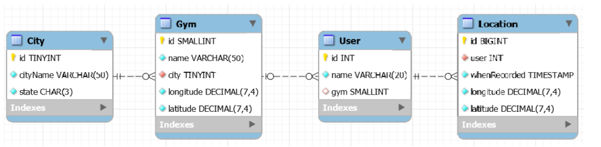

# Geolocation data analysis with SQL queries

## About the project

It aims to analyse user data and solve related questions. There are ten problems described in SQL file `queries.sql` along with the corresponding SQL queries.   

For simplicity, the solution computes the distance between two locations as below:

    distance (km) = sqrt( (P1.latitude – P2.latitude)^2 + (P1.longitude – P2.longitude)^2 ) * 100

 

## Data

The used data includes the information about gyms, gym members, and their location. The geolocation data of users is tracked per minute while they are running. The tracking program is also offered to people who are not registrated at gym members. 

 

## How to run

Firstly, load a script `setup.sql` and run all the lines to create user data. The generated tables are illustrated as below. 

Then, run each code block from `queries.sql` to see the outputs. 

 

----

:runner: :round_pushpin:....:round_pushpin:....:round_pushpin:
